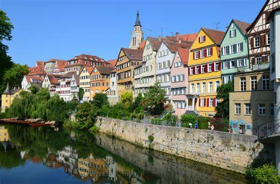
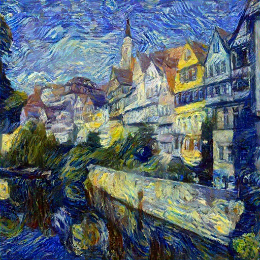
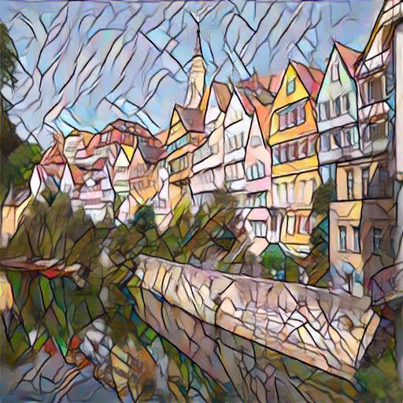

# Introduction
This is a PyTorch implementation of [Image Style Transfer Using Convolutional Neural Networks](http://openaccess.thecvf.com/content_cvpr_2016/papers/Gatys_Image_Style_Transfer_CVPR_2016_paper.pdf) by Leon A. Gatys.

# Requirements
```
Python>=3.5
```

# Installation

## Installing required packages
Install from Anaconda (recommended):
```
conda install --yes --file requirements.txt
```
Install from pip:
```
pip install -r requirements.txt
```

## Installing from the source
```
git clone https://github.com/kaimingkuang/style_transfer.git
```

# Usage
Store your content image style image under ./images/content and ./images/style, respectively. Then run:
```
python main.py --content <content.jpg> --style <style.jpg>
```
Replace <content.jpg> and <style.jpg> with your image file names.

# Examples

|Device|Image size|Running time|
|-|:-:|:-:|
|Nvidia GTX 2070|$512\times512$|3'16''|
|Intel i7-7700HQ|$512\times512$|50'16''|





